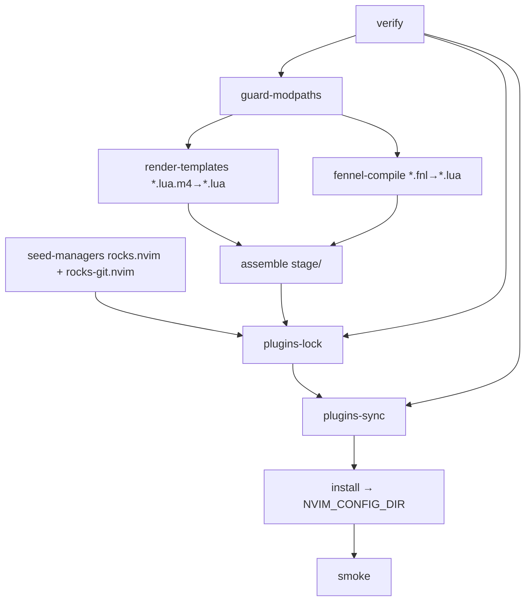

# Hermetic Neovim Configuration Build System (v3)

## Summary

We provide a **hermetic, reproducible build** for a Neovim configuration
centered on **rocks.nvim**. The build is driven by a **Makefile DAG using file
targets and pattern rules**. Runtime remains **pure Lua** — anything dynamic is
resolved **at build time** via templating (`*.lua.m4`) or ahead-of-time Fennel
compilation (`*.fnl → *.lua`).

Key decisions:

* **Shell**: Bash (strict mode)
* **Staging**: all artifacts assembled under `./stage/nvim/`, then installed to
  the final config directory
* **Templating**: `*.lua.m4 → *.lua` (encode environment directly in code)
* **Fennel**: build-time only (`*.fnl → *.lua`), no dependency on Fennel at runtime
* **Seeds**: `rocks.nvim` and `rocks-git.nvim` are cloned / pinned into
  `pack/rocks/start` so `:Rocks` works visibly and deterministically on first
  boot
* **Isolation**: plugins install into a **hermetic LuaRocks tree**, not system
  Lua
* **Safety**: module-path uniqueness guard guarantees a module has exactly one
  implementation

The **runtime remains trivial**: load Lua and run.

---

## Goals

* **Capable system → bail fast** on missing prereqs
* **Fully managed and isolated plugin installation**
* **Minimal runtime overhead** — do work *before* install
* **rocks.nvim first**

---

## Repository & directory layouts

### Source tree (updated: **single module tree**)

```
repo/
├─ nvim/
│  ├─ init.lua
│  ├─ rocks.toml
│  ├─ lua/                     # one logical module tree
│  │   ├─ config/
│  │   │   ├─ env.lua.m4       # m4 template → Lua
│  │   │   ├─ session.fnl      # Fennel → Lua
│  │   │   └─ ui.lua           # plain Lua
│  │   └─ lsp/...
│  ├─ after/ ftplugin/ colors/ plugin/   # optional
├─ build/                      # build assets, not installed
│  ├─ bin/                     # e.g., vendored fennel
│  └─ m4/                      # shared macros
├─ stage/                      # assembled install image (gitignored)
├─ Makefile                    # interface and orchestration
├─ stage.mk                    # prepare Lua modules
└─ seed.mk                     # prepare hermatic Lua Rocks
```

**Invariant:** For a given module path (e.g., `config.session`), **exactly
one** of the following exists in `nvim/lua/**`:

* `module.lua`
* `module.lua.m4`
* `module.fnl`

This keeps reviews clean — the *module* is the unit of thought.

### Installed runtime

```
NVIM_CONFIG_DIR/
├─ init.lua
├─ rocks.toml
├─ rocks.lock
├─ lua/        # rendered templates + compiled fnl + copied lua
├─ after/ plugin/ ...
└─ pack/rocks/start/
     ├─ rocks.nvim
     └─ rocks-git.nvim
```

### Hermetic rocks tree

```
NVIM_ROCKS_DIR/
├─ share/lua/5.1/ ...
└─ lib/lua/5.1/ ...
```

---

## Destination path resolution (updated)

We respect XDG environment variables automatically:

```make
XDG_CONFIG_HOME ?= ${HOME}/.config
XDG_CACHE_HOME  ?= ${HOME}/.cache

NVIM_CONFIG ?= ${XDG_CONFIG_HOME}/nvim
NVIM_ROCKS  ?= ${XDG_CACHE_HOME}/nvim/rocks
```

Make evaluates:

```make
NVIM_CONFIG_DIR := ${NVIM_CONFIG}
NVIM_ROCKS_DIR  := ${NVIM_ROCKS}
```

Only `NVIM_CONFIG` and `NVIM_ROCKS` are documented overrides.
The **internal repository structure is not user-configurable on purpose**.

---

## Build DAG



> **This remains the conceptual phase model** — not a `.PHONY` list.

---

## Makefile public interface (updated)

Human-facing `.PHONY` targets:

| Target      | Purpose                                                    |
| ----------- | ---------------------------------------------------------- |
| `help`      | list available commands                                    |
| `show`      | show key Makefile variables / resolved paths               |
| `stage`     | produce a full `stage/nvim` image with transformed sources |
| `runtime`   | copy the runtime into stage                                |
| `seed`      | install + pin seed plugin repos into stage                 |
| `install`   | sync stage to `NVIM_CONFIG_DIR`                            |
| `test`      | conduct a smoke test                                       |
| `clean`     | remove `stage/`                                            |
| `uninstall` | remove install (and optionally cache)                      |

Everything else is **file targets & pattern rules** — not front-facing commands.

---

## Internal tasks & concepts (not `.PHONY`)

These remain important in the design, even if not exposed directly:

* **render-templates**: `*.lua.m4 → *.lua`
* **fennel-compile**: `*.fnl → *.lua`
* **assemble**: copy non-code + merge staged Lua into `stage/nvim/`
* **seed-managers**: clone & pin `rocks.nvim` + `rocks-git.nvim`
* **plugins-lock**: `:Rocks lock` headless against stage
* **plugins-sync**: `:Rocks sync` into hermetic rocks tree
* **smoke**: headless boot check

The build doc keeps these phases to preserve intent and debuggability.

---

## CI outline

1. `make verify`
2. `make stage`
3. `make seed`
4. `make install`
5. `make test`

Optional:
Cache `NVIM_ROCKS_DIR` across CI runs keyed on `(rocks.toml + rocks.lock)`.

---

## Invariants (enforced via Make)

1. **Exactly one implementation per module path**
2. **All required tools exist**
3. **No generated code in `nvim/`**
4. **All generated Lua resides in `stage/nvim/lua/`**
5. **Install comes only from stage**
6. **Hermetic LuaRocks tree is always used for plugin installation**

---

## Makefile Conventions

To keep the build system predictable, legible, and safe to change, all
Makefiles in this repository follow the conventions below.

### Variable syntax

| Kind           | Syntax      |
| -------------- | ----------- |
| Variables      | `${VAR}`    |
| Make functions | `$(func …)` |

We use `${…}` for variables to clearly distinguish them from `$(…)` Make functions.

---

### Naming and purpose of variables

| Case          | Meaning                                                                                                  |
| ------------- | -------------------------------------------------------------------------------------------------------- |
| **UPPERCASE** | Inputs / knobs that a user may set via environment or CLI (XDG variables, Neovim paths, toolchain hints) |
| **lowercase** | Internal wiring, derived paths, file lists, stamps, and implementation details                           |

Assignment rules:

* `?=` is used **only for user-overridable defaults** (typically UPPERCASE)
* `:=` is used **only for internal computed values** (typically lowercase)

Examples:

```make
# Public defaults (user may override)
XDG_CONFIG_HOME ?= ${HOME}/.config
NVIM_CONFIG     ?= ${XDG_CONFIG_HOME}/nvim

# Internal values
nvim_src_dir    := ${CURDIR}/nvim
stage_dir       := ${CURDIR}/stage
stage_nvim_dir  := ${stage_dir}/nvim
```

This separation ensures the public interface stays intentional and the internal wiring cannot be changed accidentally.

---

### Repository structure overrides

Only two overrides are supported and documented:

| Variable      | Meaning                                       |
| ------------- | --------------------------------------------- |
| `NVIM_CONFIG` | Where the final Neovim config is installed    |
| `NVIM_ROCKS`  | Where the hermetic LuaRocks tree is installed |

Everything else — including the locations of `nvim/`, `stage/`, and internal Make variables — is **not configurable on purpose**.
This protects the build from states that appear “flexible” but are almost always broken.

---

### File organization across Makefiles

To keep responsibilities crisp, Make logic is split by area of concern:

```
Makefile    → Public interface and orchestration
stage.mk    → Build the stage image (templating, Fennel, copies)
seed.mk     → Install and pin seed plugins; lock/sync via rocks.nvim
```

`Makefile` contains only:

* Variable defaults (UPPERCASE)
* Includes for subordinate `*.mk` files
* Public `.PHONY` targets (`help`, `display`, `verify`, `stage`, `seed`, `install`, `clean`, `uninstall`)

`stage.mk` and `seed.mk` contain only internal logic and define only lowercase variables (e.g., `stage_*`, `seed_*` namespaces).

---

### Phony targets vs. file targets

* `.PHONY` targets exist **only for humans** — they must be few and stable.
* All real work is expressed in **file targets** and **pattern rules**.
* Invariants (e.g., duplicate module paths) are caught **at parse time**, not as `.PHONY` rules.

This preserves a clean human interface while retaining a rich internal DAG for correctness and incremental rebuilds.

---

These conventions ensure that the Make system remains:

* predictable to reason about,
* safe to extend,
* easy to debug,
* and intentionally constrained rather than “configurable by accident.”
