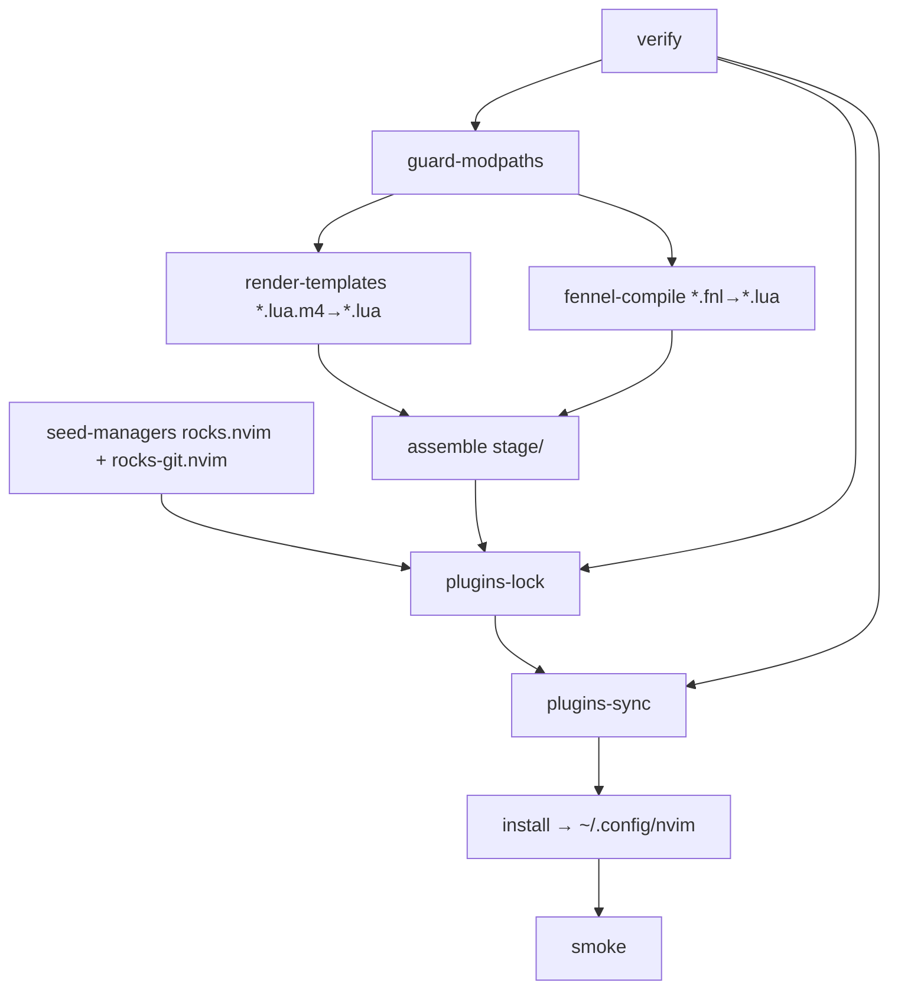

# Hermetic Neovim Configuration Build System (v2)

## Summary

We provide a **hermetic, reproducible build** for a Neovim configuration
centered on **rocks.nvim**. The build is a **Makefile-driven DAG** with real
file targets and pattern rules. Runtime remains **pure Lua**; anything dynamic
(paths, flags) is resolved **at build time** via templating and ahead-of-time
compilation.

Key decisions:

* **Shell**: Bash (strict mode).
* **Staging**: all artifacts assembled under `./stage/nvim/`, then installed to
  `~/.config/nvim/`.
* **Templating**: general rule `*.lua.m4 → *.lua` (environment written into
  code at build time).
* **Fennel**: build-time only; `*.fnl → *.lua` via a **vendored** `fennel.lua`
  and a tiny CLI wrapper (no Neovim or luarocks needed to compile).
* **Seeds**: only `rocks.nvim` and `rocks-git.nvim` are seeded (pinned) so
  `:Rocks` commands work deterministically on a fresh machine.
* **Isolation**: a dedicated LuaRocks tree/config under `~/.local/cache/nvim`
  with PATH precedence for headless steps.
* **Safety**: a module-path uniqueness guard prevents conflicts across `lua/`,
  `lua.m4`, and `fnl/`.

## Goals

* **Capable system → bail fast** if prereqs are missing.
* **Fully managed, isolated rocks**: nothing leaks into system Lua.
* **Slim runtime**: heavy lifting during the build.
* **rocks.nvim first** for package management.&#x20;

## Repository & directory layouts

### Source repo

```
repo/
├─ nvim/                      # mirrors runtime layout
│  ├─ init.lua
│  ├─ rocks.toml
│  ├─ lua/                    # handwritten Lua and *.lua.m4 templates
│  │  └─ config/
│  │     └─ env.lua.m4        # template → env.lua at build time
│  ├─ fnl/                    # optional: Fennel sources (build-time only)
│  ├─ after/ ftplugin/ colors/ plugin/   # optional trees
├─ build/
│  ├─ bin/                    # tools used by the build (e.g., fennel wrapper)
│  ├─ m4/                     # shared macros (e.g., common.m4)
│  └─ scripts/
│     ├─ fennel.lua           # vendored Fennel compiler
│     └─ generate-help.awk    # AWK for `make help` (#> / #!)
├─ stage/                     # assembled install image (gitignored)
└─ Makefile
```

### Installed runtime (`~/.config/nvim/`)

```
~/.config/nvim/
├─ init.lua
├─ rocks.toml
├─ rocks.lock
├─ lua/          # includes rendered templates and compiled fnl
├─ after/ ftplugin/ colors/ plugin/
└─ pack/rocks/start/
   ├─ rocks.nvim
   └─ rocks-git.nvim
```

### Hermetic cache

```
~/.local/cache/nvim/
├─ rocks/        # isolated rocks tree (code & native libs live here)
└─ luarocks/     # LUAROCKS_CONFIG lives here
```

## 4) Build DAG



## 5Tasks & responsibilities (Makefile)

* **verify**: check `bash`, `nvim ≥ 0.10`, `git`, `curl/wget`, `m4`, and
  **`lua` or `luajit` (5.1 ABI)**. Fail fast with clear messages.
* **guard-modpaths**: ensure no module path is defined by more than one of
  `lua/`, `lua.m4`, `fnl/`.
* **render-templates**: general `*.lua.m4 → *.lua` with `m4 -P` and repo
  macros. Defines passed include:

  * `ROCKS_TREE`, `LUAROCKS_CONFIG`, `CACHE_HOME`, `CONFIG_HOME`,
  * `NVIM_CONFIG_DIR`, `STAGE_NVIM_DIR`, `NVIM_ENV`, `TOOLCHAIN_BIN`.
* **fennel-compile**: `*.fnl → *.lua` using `build/bin/fennel`, which runs our
  vendored `build/scripts/fennel.lua` via host `luajit` or `lua`.
* **assemble**: copy sources + rendered Lua + compiled Fennel into
  `stage/nvim/`.
* **seed-managers**: clone & **pin** `rocks.nvim` and `rocks-git.nvim` into
  `stage/nvim/pack/rocks/start/…` (commit SHA or ref).
* **plugins-lock**: `:Rocks lock` headless **against `stage/`**, with PATH
  precedence to ensure the right tools.
* **plugins-sync**: `:Rocks sync` headless, installing into the **hermetic
  rocks tree**.
* **install**: rsync `stage/nvim/` → `~/.config/nvim/`.
* **smoke**: headless boot check.
* **clean / uninstall**: remove artifacts; `uninstall FORCE=1` also removes
  `~/.config/nvim`.

## External tool expectations

We verify rocks.nvim’s documented prerequisites:

* **Neovim ≥ 0.10**, `git`, `curl` or `wget`, `make`, `unzip` (if needed by
  bootstrap paths).
* **Lua/LuaJIT 5.1 on PATH** (binary name `lua` or `luajit`)—we verify and
  prefer `luajit` when present.
* **netrw** enabled (default), not explicitly disabled.

Headless steps prepend `build/bin` (and optional `TOOLCHAIN_BIN`) to PATH so
rocks.nvim sees the intended tools first.

## Isolation & LuaRocks

* A dedicated `LUAROCKS_CONFIG` under `~/.local/cache/nvim/luarocks/` points
  **exclusively** to `~/.local/cache/nvim/rocks` (no system tree).
* Headless `:Rocks` invocations export `LUAROCKS_CONFIG` so any rocks-managed
  artifacts land in the isolated tree.
* If native rocks are used, we can enrich `LUAROCKS_CONFIG` with `variables`
  (e.g., `LUA_INCDIR/LUA_LIBDIR`) based on detected host Lua/LuaJIT.

## Configuration strategy

* **Baseline config** uses `neovim-sensible` as the platform; our opinionated
  layer will be added later.
* All plugin declarations live in **`rocks.toml`**; we rely on the **native
  lock** (`rocks.lock`). Seeds are not required to be listed in TOML; they are
  installed/pinned by the build to guarantee `:Rocks` availability from the
  first run.&#x20;
* **`env.lua`** is generated from `env.lua.m4` so runtime knows the actual
  cache paths (`ROCKS_TREE`, `LUAROCKS_CONFIG`, etc.) without hard-coding them
  in source.

## CI outline

1. `make verify`
2. `make render-templates fennel-compile assemble`
3. `make seed-managers`
4. `make plugins-lock plugins-sync`
5. `make install smoke`

Cache `~/.local/cache/nvim/rocks` between runs keyed by `rocks.toml` + lock to
speed up CI.
