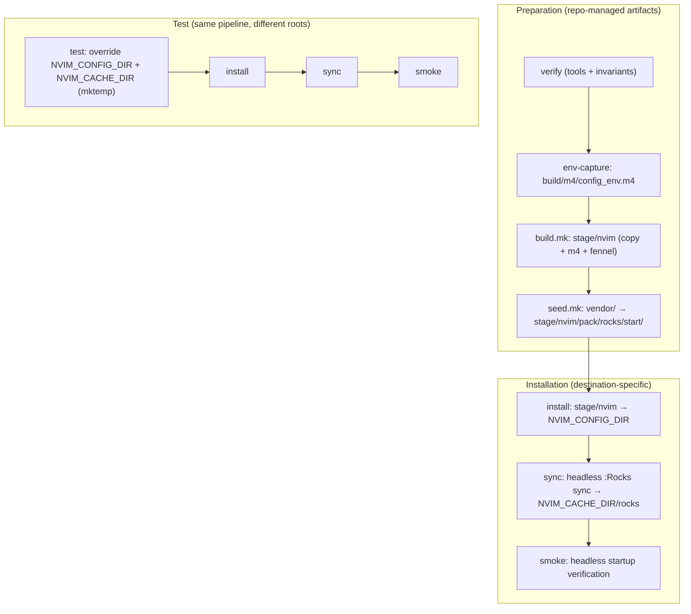

# Hermetic Neovim Configuration Build System

This document describes the **design and invariants** of the Neovim
configuration build system. It explains *why* the system is structured the way
it is and what guarantees it provides.

This is **not** an installation guide — see `README.md` for usage.

---

## Summary

We provide a **hermetic, reproducible build** for a Neovim configuration centered
on **rocks.nvim**.

The system is driven by a **Makefile DAG using file targets and pattern rules**.
All transformation work happens **before installation**. The runtime executes
**pure Lua only** — no discovery, probing, or dynamic configuration for concerns
that are known at build time.

Key decisions:

* **Shell**: Bash (strict mode)
* **Stage (build.mk)**: prepares *repo-managed artifacts only* under `stage/nvim/`
* **Seed (seed.mk)**: copies vendored plugin managers into `stage/nvim/`
* **Install**: copies staged artifacts into `NVIM_CONFIG_DIR`
* **Test**: performs a complete installation and sync using temporary directory
  overrides
* **Templating**: `*.lua.m4 → *.lua` at build time
* **Fennel**: compiled at build time only (`*.fnl → *.lua`)
* **Isolation**: plugins install into a hermetic LuaRocks tree derived from
  `NVIM_CACHE_DIR` (never system Lua)
* **M4 discipline**: all build-time m4 symbols are prefixed with `NV_M4_`
* **Idempotence**: rely on Make's dependency model; use content comparison only
  where timestamps cannot represent change (environment capture)

The runtime remains trivial: **load Lua and run**.

---

## Goals

* **Hermetic** — no dependency on system Lua or global plugin trees
* **Reproducible** — same inputs yield the same runtime
* **Minimal runtime** — no dynamic work for build-known concerns
* **Fail fast** — missing prerequisites or invariants cause immediate failure
* **rocks.nvim first** — plugin management is explicit and deterministic

---

## Probing Policy

This project uses "probing" in four distinct contexts. The key rule is to
**avoid probing internal build outputs to compensate for uncertain build
behavior**, while still supporting **host discovery** and **invariant
verification**.

### 1) Host discovery (desired)

Host systems vary (Linux distros, Homebrew vs apt, different PATH layouts). The
build must be resilient to these differences.

* `environment.mk` may **discover required tools via PATH** (e.g., `command -v`)
  and treat "tool is invokable" as the only requirement.
* We do not care where tools are installed, only that they are available on PATH
  (or provided via override).
* **Lua is part of host discovery**, with an additional compatibility constraint:

  * Acceptable runtimes are **LuaJIT** or **Lua 5.1**.
  * `environment.mk` may select from a small, explicit set of likely command
    names (e.g., `luajit`, `lua` if it is 5.1, `lua5.1`).
  * Users may override the selected command (e.g., `LUA_CMD=...`) to force a
    specific runtime.

**Principle:** Host discovery is not "guessing." It is a portability feature
with explicit constraints and optional user overrides.

### 2) Build-time guarantees (required)

Build-time substitutions and build outputs are treated as **authoritative**.

* Neither build-time Make logic nor runtime Lua/Vim code should **probe internal
  structures to see if build-time substitutions "worked."**
* Avoid patterns like:

  * "Define a path, then check if it exists to decide whether the definition
    was correct."
  * "Try one internal directory layout, then fall back to another if the first
    looks wrong."
  * "Compute derived variables and then conditionally rewrite them based on
    observed filesystem state."

If a build-time substitution is incorrect, that is a **build failure**, not
something to be papered over.

**Principle:** The build should be deterministic. Internal probing is a code
smell that usually indicates missing validation or unclear ownership.

### 3) Testing and verification (desired)

Probing is encouraged in tests and verification targets to enforce invariants.

* A `verify` target (and/or CI checks) should probe to confirm:

  * Required host tools exist and are runnable.
  * Required versions/invariants hold (e.g., LuaJIT or Lua 5.1).
  * Generated artifacts exist and meet expectations (e.g., templated files
    contain no unresolved placeholders, expected directories are created).
* Fail fast with clear error messages that explain what is missing and how to
  fix it.

**Principle:** "Probe to verify invariants" is good. It keeps build/runtime
code simple while still catching mistakes early.

### 4) Runtime probing (allowed only for non-guaranteed concerns)

Runtime code may probe only for concerns that **cannot** be guaranteed at build
time, or for optional integrations.

Examples:

* Optional developer tools or features that may not exist on every system.
* Runtime environment differences that appear after installation (e.g.,
  user-specific PATH changes, editor running in constrained environments).
* Graceful degradation when a non-essential dependency is missing.

Runtime probing should not be used to "repair" or reinterpret the build output.

**Principle:** Runtime probing is for *optional or inherently dynamic*
conditions, not for validating the build pipeline.

### Summary

* **Host discovery:** yes (including Lua), with explicit constraints and overrides.
* **Build-time guarantees:** no internal probing to see if the build "worked."
* **Testing:** yes—probe hard to verify invariants and fail fast.
* **Runtime:** probe only for what build-time cannot guarantee (optional/dynamic concerns).

---

## Repository layout

### Source tree

```
repo/
├─ nvim/
│  ├─ init.lua
│  ├─ rocks.toml
│  ├─ lua/
│  │   ├─ config/
│  │   │   ├─ env.lua.m4
│  │   │   ├─ options.lua
│  │   │   ├─ keymaps.lua
│  │   │   ├─ autocmds.lua
│  │   │   └─ util.lua
│  │   └─ lsp/...
│  ├─ after/ ftplugin/ colors/ plugin/   # optional runtime dirs
├─ build/
│  ├─ bin/       # vendored tools (e.g., fennel)
│  ├─ m4/        # shared m4 macros + generated env capture
│  └─ scripts/   # headless helper scripts (e.g., rocks_sync.lua)
├─ vendor/
│  ├─ rocks.nvim/       # git submodule, pinned to exact SHA
│  └─ rocks-git.nvim/   # git submodule, pinned to exact SHA
├─ stage/        # build outputs (gitignored)
├─ Makefile
├─ environment.mk
├─ project.mk
├─ build.mk
└─ seed.mk
```

### Module uniqueness invariant

For a given Lua module path (e.g., `config.session`), **exactly one**
implementation exists in `nvim/lua/**`:

* `module.lua`
* `module.lua.m4`
* `module.fnl`

This invariant is enforced by Make at parse time by detecting duplicate staged
targets.

### Plugin manifest

`rocks.toml` is the **single canonical plugin manifest**. It lives at
`nvim/rocks.toml` in the source tree and is copied to `stage/nvim/rocks.toml`
during build. There is no second manifest.

---

## Destination paths

We respect XDG base directory variables:

```make
XDG_CONFIG_HOME ?= ${HOME}/.config
XDG_CACHE_HOME  ?= ${HOME}/.cache

NVIM_CONFIG_DIR ?= ${XDG_CONFIG_HOME}/nvim
NVIM_CACHE_DIR  ?= ${XDG_CACHE_HOME}/nvim
```

The hermetic LuaRocks tree is derived internally:

```make
nvim_rocks_dir := ${NVIM_CACHE_DIR}/rocks
```

Only `NVIM_CONFIG_DIR` and `NVIM_CACHE_DIR` are documented overrides.
All other paths are intentionally internal and non-configurable.

---

## M4 symbol conventions

All m4 symbols that survive outside a local template file are prefixed with
`NV_M4_`.

There are two layers of m4 usage:

1. **Static macros** under `build/m4/`

   * e.g., `NV_M4_LUA_VER` (in `constants.m4`)
   * e.g., `NV_M4_SITE_DIR`, `NV_M4_OPT_DIR`, `NV_M4_START_DIR`
     (in `paths.m4`)

2. **Generated macros** written during the build to `build/m4/config_env.m4`

   * `NV_M4_NVIM_ROCKS_DIR`
   * `NV_M4_LUAROCKS_CONFIG_DIR`
   * `NV_M4_LUAROCKS_CONFIG`

The prefix rule prevents collisions with m4 builtins, third-party macros, and
accidental reuse across templates.

### Quoting convention

All `.m4` files under `build/m4/` use **m4 default quoting** (backtick /
single-quote). The `common.m4` helper macros use `changequote` to `-<-< / >->-`
and are intended for inclusion **only from `.lua.m4` templates**, where Lua's
own use of quotes would otherwise collide with m4 syntax. Static macro files
(`constants.m4`, `paths.m4`, `config_env.m4`) are included *before*
`common.m4` or use default quoting.

### Macro expansion in paths.m4

`paths.m4` defines derived path macros using eager expansion. The macro
name referenced inside the definition body must be **outside quotes** so that
m4 expands it at define time (which is correct because `config_env.m4` has
already been included and its values are available):

```m4
m4_include(`config_env.m4')
m4_define(`NV_M4_SITE_DIR',  NV_M4_NVIM_ROCKS_DIR`/share/nvim/site')
m4_define(`NV_M4_OPT_DIR',   NV_M4_SITE_DIR`/pack/rocks/opt')
m4_define(`NV_M4_START_DIR', NV_M4_SITE_DIR`/pack/rocks/start')
```

This ensures that when a `.lua.m4` template expands `NV_M4_SITE_DIR`, it
receives the fully resolved path.

---

## Environment capture (`build/m4/config_env.m4`)

Some build inputs are derived from the user's environment and cannot be tracked
purely via Make's timestamp-based dependency graph (because the environment can
change while file mtimes do not).

To address this, `project.mk` generates `build/m4/config_env.m4` that captures
the derived install/cache paths as m4 symbols.

**Idempotence rule for env capture:** the generator must not rewrite the file if
the content is byte-identical. This is implemented by writing a temporary file
and using `cmp` before replacing the target.

**PHONY discipline:** `config_env` is marked `.PHONY` so its recipe runs every
time (environment is not a file). Downstream targets that depend on it should
use **order-only prerequisites** (`| ${config_env}`) to avoid unconditional
rebuilds. The actual rebuild trigger for downstream targets is the file's mtime,
which only changes when the content changes (thanks to the `cmp` guard).

Downstream m4 templates include this file and therefore correctly rebuild when
the environment meaningfully changes.

---

## Build and installation phases

The system is deliberately split into **preparation** and **installation**
phases.

### Preparation (repo-managed artifacts only)

`build.mk` produces `stage/nvim/` containing only artifacts derived from the
repo:

* copy top-level runtime files (`init.lua`, `rocks.toml`)
* render `*.lua.m4 → *.lua`
* compile `*.fnl → *.lua`

`seed.mk` copies vendored seed plugins into `stage/nvim/pack/rocks/start/`:

* `vendor/rocks.nvim/ → stage/nvim/pack/rocks/start/rocks.nvim/`
* `vendor/rocks-git.nvim/ → stage/nvim/pack/rocks/start/rocks-git.nvim/`

No network access, no third-party clones, and no runtime state appear in stage.

### Installation (destination-specific)

`install` copies `stage/nvim/** → NVIM_CONFIG_DIR/**` via rsync.

### Sync

`sync` runs a headless Neovim that:

1. points `rtp`/`packpath` at the installed `NVIM_CONFIG_DIR`
2. loads `config.env` (wires hermetic paths)
3. runs `:Rocks sync` to install plugins into `nvim_rocks_dir`

This is the **only** step that requires network access.

### Test (smoke)

`test` performs a **complete installation and sync** using temporary
directories:

* `NVIM_CONFIG_DIR=$(mktemp -d …)`
* `NVIM_CACHE_DIR=$(mktemp -d …)`
* run the same build → install → seed → sync pipeline
* verify that Neovim starts headlessly without errors

This ensures that **test and install use identical logic**, differing only by
their destination roots. The test is the smoke test — if sync completes and
Neovim starts, the project is working.

---

## Seed plugins (vendored submodules)

### Rationale

Seed plugin managers (`rocks.nvim` and `rocks-git.nvim`) are **vendored as git
submodules** under `vendor/` rather than cloned at build time. This provides:

* **No network dependency during build.** The build is fully offline. Network
  access is only needed for `:Rocks sync` (which downloads the actual plugin
  set).
* **Trivial pin tracking.** Submodule SHAs are recorded in the repo. Changing
  a pin is a `git submodule update` commit — visible in diffs, auditable, and
  requires no custom stamp-file logic in Make.
* **Simplified seed.mk.** Seeding becomes a directory copy (rsync), not a
  clone + checkout + stamp-file dance.
* **Reproducibility.** The exact seed plugin code is committed to the repo.

### Submodule setup

```bash
git submodule add https://github.com/nvim-neorocks/rocks.nvim.git vendor/rocks.nvim
git submodule add https://github.com/nvim-neorocks/rocks-git.nvim.git vendor/rocks-git.nvim
```

To pin to a specific release:

```bash
cd vendor/rocks.nvim && git checkout v2.45.1 && cd ../..
git add vendor/rocks.nvim
git commit -m "pin rocks.nvim to v2.45.1"
```

### seed.mk responsibility

`seed.mk` copies vendored plugins into the stage:

```make
${stage_nvim_dir}/pack/rocks/start/rocks.nvim: vendor/rocks.nvim
	rsync -a --delete $</ $@/

${stage_nvim_dir}/pack/rocks/start/rocks-git.nvim: vendor/rocks-git.nvim
	rsync -a --delete $</ $@/
```

Make's dependency model handles invalidation automatically: if a submodule is
updated (changing the directory mtime), the corresponding stage target rebuilds.

### LuaRocks config

`seed.mk` also writes the hermetic LuaRocks config file. This config points
LuaRocks at `nvim_rocks_dir` so all plugin installations are isolated:

```make
${luarocks_config}: | ${luarocks_config_dir}
	echo 'rocks_trees = {{ name = "user", root = "${nvim_rocks_dir}" }}' > $@
```

The LuaRocks config is written to `${nvim_rocks_dir}/luarocks/config.lua`
(derived from `NVIM_CACHE_DIR`, never hardcoded).

---

## Mermaid overview



Notes:

* The test pipeline is intentionally the **same** as install, just rooted in
  temporary directories.
* Seed plugins are part of the stage, not a separate install-time step.
* Env capture is the only place we use content comparison to avoid spurious
  timestamp churn.

---

## Installed runtime (post-install + sync)

```
NVIM_CONFIG_DIR/
├─ init.lua
├─ rocks.toml
├─ lua/
│  └─ config/
│     ├─ env.lua         (rendered from env.lua.m4)
│     ├─ options.lua
│     ├─ keymaps.lua
│     ├─ autocmds.lua
│     └─ util.lua
├─ after/ plugin/ ...
└─ pack/rocks/start/
     ├─ rocks.nvim/
     └─ rocks-git.nvim/
```

The presence of the seed plugins in `pack/rocks/start/` guarantees that
`:Rocks sync` can run deterministically on first boot.

---

## Idempotence and change detection

For normal build steps (copying files, rendering templates, compiling Fennel),
the system relies on **Make's standard dependency and timestamp semantics**.

Explicit content comparison (`cmp`) is used **only** for environment capture
(`build/m4/config_env.m4`) because environment changes cannot be modeled by
file mtimes alone.

This ensures:

* repeated `make stage` runs are no-ops when inputs are unchanged
* environment changes propagate correctly
* timestamp churn is avoided without over-complicating rules

---

## Makefile interface

Human-facing `.PHONY` targets are intentionally few and stable:

| Target             | Purpose                                          |
| ------------------ | ------------------------------------------------ |
| `help`             | list available commands                          |
| `show`             | display resolved paths and variables             |
| `stage`            | prepare staged artifacts (code + seeds)          |
| `install`          | install staged artifacts into `NVIM_CONFIG_DIR`  |
| `sync`             | install + headless `:Rocks sync`                 |
| `test`             | full install + sync into temp directories        |
| `clean`            | remove `stage/`                                  |
| `uninstall`        | remove installed config (requires `FORCE=1`)     |
| `uninstall-cache`  | remove config + hermetic rocks cache             |

All real work is expressed as **file targets and pattern rules**.

---

## Invariants

The system enforces the following invariants:

1. Exactly one implementation per module path
2. All required tools must exist
3. No generated code appears in `nvim/`
4. Stage contains only repo-managed artifacts (including vendored seeds)
5. Seed plugins are vendored submodules, copied into stage during build
6. Test and install differ only by destination directories
7. A hermetic LuaRocks tree is always used for plugin installation
8. All exported m4 symbols are prefixed with `NV_M4_`
9. `rocks.toml` is the single canonical plugin manifest

---

## Mental model summary

| Phase   | Responsibility                             |
| ------- | ------------------------------------------ |
| Build   | Transform repo sources into stage          |
| Seed    | Copy vendored plugin managers into stage   |
| Install | Copy staged artifacts into destination     |
| Sync    | Install plugins deterministically (network)|
| Test    | Install + sync in temp dirs; smoke test    |
| Runtime | Load pure Lua, no build-known probing      |

Complexity is intentionally moved **left** into the build so runtime behavior
remains simple, fast, and predictable.
